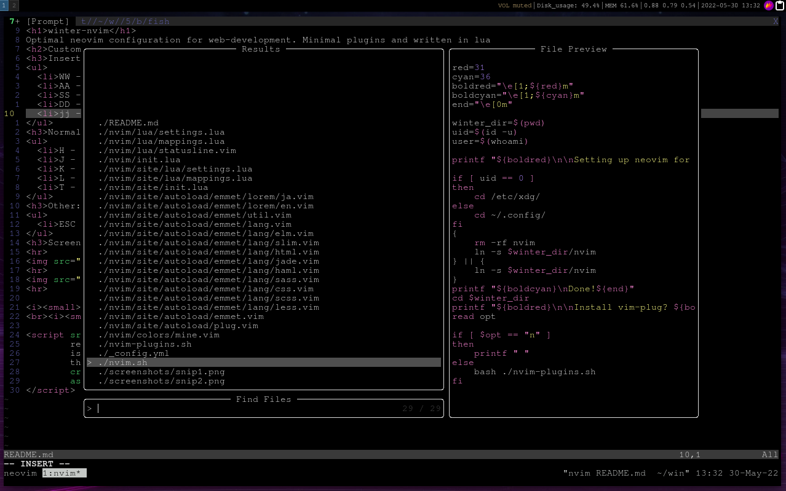
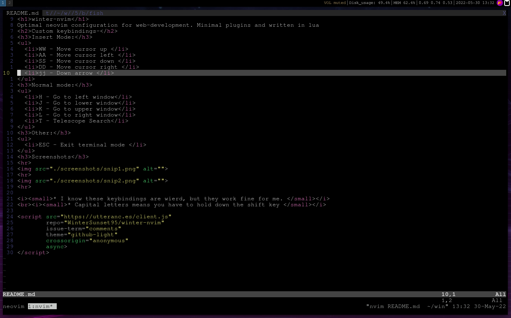

<h1>winter-nvim</h1>
Optimal neovim configuration for web-development. Minimal plugins and written in lua
<h2>Custom keybindings-</h2>
<h3>Insert Mode:</h3>
<ul>
  <li>WW - Move cursor up </li>
  <li>AA - Move cursor left </li>
  <li>SS - Move cursor down </li>
  <li>DD - Move cursor right </li>
  <li>jj - Down arrow </li>
</ul>
<h3>Normal mode:</h3>
<ul>
  <li>H - Go to left window</li>
  <li>J - Go to lower window</li>
  <li>K - Go to upper window</li>
  <li>L - Go to right window</li>
  <li>T - Telescope Search</li>
</ul>
<h3>Other:</h3>
<ul>
  <li>ESC - Exit terminal mode </li>
</ul>
<h3>Screenshots</h3>

<i><small>* I know these keybindings are wierd, but they work fine for me. </small></i>
 <i><small>* Capital letters means you have to hold down the shift key </small></i>

